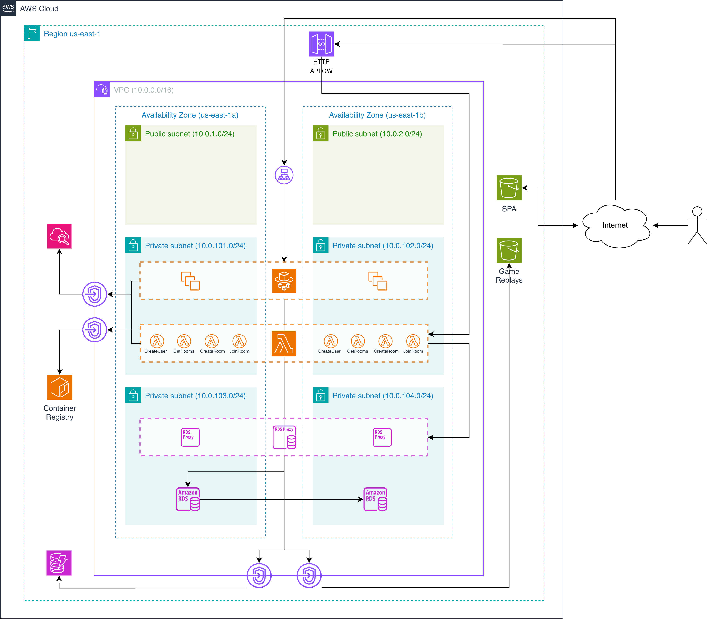

# 🐢 Turtle Battleships

Turtle Battleships is a cloud-based implementation of the classic Battleships game, leveraging modern cloud technologies for scalability and performance. In this repository, we store all of the application code (backend and frontend) as well as the infrastructure code using Terraform.

The focus of this project is to demonstrate best practices in cloud architecture, including the use of serverless technologies, containerization, and infrastructure as code. Thus, the application code is not the main focus, but rather a means to showcase the infrastructure setup; because of this, the code may not follow best practices for application development.

---

* [Infrastructure Overview](#infrastructure-overview)
    * [Terraform Modules](#terraform-modules)
        * [VPC Module (./terraform/vpc)](#vpc-module-terraformvpc)
        * [DynamoDB Module (./terraform/dynamodb)](#dynamodb-module-terraformdynamodb)
        * [Lambda with ECR Integration Module (./terraform/lambda-with-ecr)](#lambda-with-ecr-integration-module-terraformlambda-with-ecr)
        * [ECS Fargate Module (./terraform/ecs-fargate)](#ecs-fargate-module-terraformecs-fargate)
        * [S3 Module (./terraform/s3)](#s3-module-terraforms3)
        * [API Gateway Modules (./terraform/api-gateway)](#api-gateway-modules-terraformapi-gateway)
            * [1. REST API Gateway (./terraform/api-gateway/rest-api)](#1-rest-api-gateway-terraformapi-gatewayrest-api)
            * [2. WebSocket API Gateway (./terraform/api-gateway/websocket-api)](#2-websocket-api-gateway-terraformapi-gatewaywebsocket-api)
        * [RDS Module (<a href="https://google.com" rel="nofollow">External Module</a>)](https://google.com)
    * [Terraform Functions and Meta-Arguments](#terraform-functions-and-meta-arguments)
        * [Built-in Functions](#built-in-functions)
        * [Meta-Arguments](#meta-arguments)
        * [Data Sources](#data-sources)
* [Step-by-Step Execution Guide](#step-by-step-execution-guide)
    * [Prerequisites](#prerequisites)
    * [Step 1: Clone the Repository](#step-1-clone-the-repository)
    * [Step 2: Configure AWS Credentials](#step-2-configure-aws-credentials)
    * [Step 3: Review and Customize Configuration](#step-3-review-and-customize-configuration)
    * [Step 4: Initialize Terraform](#step-4-initialize-terraform)
    * [Step 5: Review the Execution Plan](#step-5-review-the-execution-plan)
    * [Step 6: Deploy the Infrastructure](#step-6-deploy-the-infrastructure)
    * [Step 7: Verify Deployment](#step-7-verify-deployment)
* [Final Remarks](#final-remarks)

---

## Infrastructure Overview



### Terraform Modules

This project uses custom Terraform modules to create a scalable, modular infrastructure on AWS. Each module is designed to be reusable and follows best practices for cloud infrastructure.

#### VPC Module (`./terraform/vpc`)

**Purpose**: Creates a complete AWS Virtual Private Cloud with dynamic subnet allocation, route tables, and VPC endpoints.

**Key Features**:
- Dynamic subnet creation (private/public) across multiple availability zones
- Automatic route table associations
- VPC Endpoints for private AWS service access (Gateway and Interface types)
- Support for custom CIDR ranges and subnet naming

**Resources Created**:
- VPC with DNS support and hostnames enabled
- Subnets (configurable per availability zone)
- Route tables with automatic associations
- VPC Endpoints for S3, DynamoDB, ECR, CloudWatch Logs

**Inputs**:
- `vpc_config`: VPC name, CIDR block, and region
- `subnets_config`: List of subnet configurations (name, CIDR, AZ, type)
- `route_tables_config`: Map of route tables to subnet associations
- `vpc_endpoints_config`: List of VPC endpoints with service names and types

#### DynamoDB Module (`./terraform/dynamodb`)

**Purpose**: Creates fully-configured DynamoDB tables with advanced features.

**Key Features**:
- Support for both PAY_PER_REQUEST and PROVISIONED billing modes
- Global Secondary Indexes (GSI) configuration
- Server-side encryption with AWS-managed or customer-managed keys
- Point-in-Time Recovery (PITR) for disaster recovery
- Time-to-Live (TTL) for automatic item expiration
- Custom attribute definitions

**Resources Created**:
- DynamoDB table
- Global Secondary Indexes (if specified)
- CloudWatch alarms (optional)

**Inputs**:
- `name`: Table name
- `billing_mode`: PAY_PER_REQUEST or PROVISIONED
- `partition_key`: Primary partition key
- `sort_key`: Optional sort key
- `attributes`: List of attribute definitions
- `global_secondary_indexes`: List of GSI configurations
- `encryption`: Encryption settings
- `point_in_time_recovery`: Boolean for PITR
- `ttl`: TTL configuration

#### Lambda with ECR Integration Module (`./terraform/lambda-with-ecr`)

**Purpose**: Creates AWS Lambda functions using Docker containers stored in ECR, with automatic build and deployment.

**Key Features**:
- Automatic Docker image build and push to ECR
- Support for VPC configuration (private subnet deployment)
- Environment variable injection
- CloudWatch Logs integration
- Auto-rebuild triggers on Dockerfile changes
- AWS Academy LabRole compatible

**Resources Created**:
- ECR repository
- Docker image (built and pushed)
- Lambda function
- CloudWatch Log Group
- IAM policies (attached to existing role)

**Inputs**:
- `function_name`: Lambda function name
- `dockerfile_path`: Path to Dockerfile directory
- `role_arn`: ARN of existing IAM role (e.g., LabRole)
- `memory_size`: Memory allocation in MB
- `timeout`: Function timeout in seconds
- `environment_variables`: Map of environment variables
- `vpc_config`: Optional VPC configuration

#### ECS Fargate Module (`./terraform/ecs-fargate`)

**Purpose**: Deploys containerized applications on ECS Fargate with Application Load Balancer and auto-scaling.

**Key Features**:
- Automatic Docker build and ECR push
- ECS cluster and service creation
- Application Load Balancer with health checks
- CloudWatch logging
- CPU-based auto-scaling
- VPC Link support for API Gateway integration
- AWS Academy LabRole compatible

**Resources Created**:
- ECR repository
- ECS cluster
- ECS task definition
- ECS service
- Application Load Balancer
- Target group with health checks
- CloudWatch Log Group
- Auto-scaling policies (optional)

**Inputs**:
- `service_name`: Name of the ECS service
- `dockerfile_path`: Path to Dockerfile directory
- `container_port`: Port the container listens on
- `cpu`: CPU units (256 = 0.25 vCPU)
- `memory`: Memory in MB
- `desired_count`: Number of tasks to run
- `vpc_id`: VPC ID for ALB
- `subnet_ids`: Subnets for ECS tasks and ALB
- `health_check_path`: ALB health check endpoint
- `enable_autoscaling`: Enable CPU-based auto-scaling

#### S3 Module (`./terraform/s3`)

**Purpose**: Creates S3 buckets with advanced configurations including website hosting and automatic file uploads.

**Key Features**:
- Optional versioning
- Server-side encryption (AES256 or KMS)
- Public access block configuration
- Website hosting for SPAs
- CORS configuration
- Custom bucket policies
- Automatic file upload from local directory

**Resources Created**:
- S3 bucket
- Bucket policy (if specified)
- Website configuration (optional)
- CORS rules (optional)
- Uploaded files (optional)

**Inputs**:
- `bucket_name`: Unique bucket name
- `versioning_enabled`: Enable versioning
- `encryption_enabled`: Enable encryption
- `website_enabled`: Enable static website hosting
- `index_document`: Index page for website
- `error_document`: Error page for website
- `cors_rules`: CORS configuration
- `bucket_policy`: Custom bucket policy
- `upload_enabled`: Enable automatic file upload
- `upload_source_dir`: Local directory to upload

#### API Gateway Modules (`./terraform/api-gateway`)

**Purpose**: Creates AWS API Gateway for REST and WebSocket APIs, providing external access to Lambda functions and Fargate services.

This directory contains two sub-modules:

##### 1. REST API Gateway (`./terraform/api-gateway/rest-api`)

**Purpose**: Creates API Gateway REST API for Lambda function integrations.

**Key Features**:
- Lambda proxy integrations with automatic permissions
- CORS support with automatic OPTIONS method handling
- CloudWatch logging and metrics
- X-Ray tracing support
- Throttling configuration
- Multiple HTTP methods per endpoint
- Automatic redeployment on changes

**Resources Created**:
- API Gateway REST API
- API Gateway resources and methods
- Lambda integration and permissions
- API Gateway deployment and stage
- CloudWatch Log Group

**Inputs**:
- `api_name`: Name of the API Gateway
- `stage_name`: Deployment stage name
- `lambda_integrations`: List of Lambda function configurations
  - `path_part`: URL path (e.g., "users", "rooms")
  - `http_methods`: HTTP methods (e.g., ["GET", "POST"])
  - `lambda_arn`: Lambda function invoke ARN
  - `lambda_name`: Lambda function name
  - `enable_cors`: Enable CORS support
- `xray_tracing_enabled`: Enable X-Ray tracing
- `log_retention_days`: CloudWatch log retention
- `throttling_burst_limit`: API throttling burst limit
- `throttling_rate_limit`: API throttling rate limit

**Use Case**: RESTful APIs, CRUD operations, Lambda-backed HTTP endpoints

##### 2. WebSocket API Gateway (`./terraform/api-gateway/websocket-api`)

**Purpose**: Creates API Gateway WebSocket API connected to Fargate via Network Load Balancer and VPC Link.

**Key Features**:
- AWS API Gateway V2 (WebSocket protocol)
- Network Load Balancer (NLB) for Fargate integration
- VPC Link for private connectivity
- Target Group with health checks
- Standard WebSocket routes ($connect, $disconnect, $default)
- Support for custom routes
- CloudWatch logging and metrics
- Throttling configuration

**Resources Created**:
- API Gateway V2 (WebSocket)
- Network Load Balancer
- Target Group
- VPC Link
- API Gateway integrations and routes
- CloudWatch Log Group

**Inputs**:
- `api_name`: Name of the WebSocket API
- `stage_name`: Deployment stage name
- `auto_deploy`: Automatic deployment on changes
- `nlb_name`: Name of the Network Load Balancer
- `nlb_internal`: Whether NLB is internal or internet-facing
- `nlb_subnet_ids`: Subnets for NLB placement
- `target_group_name`: Name of the target group
- `fargate_port`: Port where Fargate service listens
- `vpc_id`: VPC ID
- `vpc_link_name`: Name of the VPC Link
- `vpc_link_subnet_ids`: Subnets for VPC Link
- `vpc_link_security_group_ids`: Security groups for VPC Link
- `custom_routes`: Additional WebSocket routes

**Use Case**: Real-time communication, WebSockets, Socket.io, long-lived bidirectional connections

#### RDS Module ([`External Module`](https://google.com))

TODO

### Terraform Functions and Meta-Arguments

This section explains the key Terraform functions and meta-arguments used throughout the infrastructure code.

#### Built-in Functions

1. `merge()`
    * **Purpose**: Combines multiple maps into a single map.
    * **Usage in Project**:
        ```hcl
        locals {
        tags = merge(
            var.common_tags,
            {
            Project     = var.project_name
            Environment = var.environment
            }
        )
        }
        ```
    * **Explanation**: Merges common tags with project-specific tags to ensure all resources have consistent tagging.

2. `cidrsubnet()`
    * **Purpose**: Calculates a subnet CIDR block within a larger CIDR block.
    * **Usage in Project**:
        ```hcl
        private_subnets = flatten([
        for az_index, az in local.azs : [
            for subnet_index in range(length(var.subnet_names[tostring(az_index)].private)) : {
            cidr = cidrsubnet(var.vpc_cidr, 8, 101 + (az_index * var.private_subnets_per_az) + subnet_index)
            }
        ]
        ])
        ```
    * **Explanation**: Automatically calculates subnet CIDR ranges from the VPC CIDR (10.0.0.0/16), creating /24 subnets. Private subnets start at 10.0.101.0/24, and the offset ensures no overlap between AZs.

3. `flatten()`
    * **Purpose**: Converts nested lists into a flat list.
    * **Usage in Project**:
        ```hcl
        local.all_subnets = concat(local.private_subnets, local.public_subnets)
        ```
    * **Explanation**: Flattens the nested list structure created by iterating over availability zones and subnet counts.

4. `slice()`
    * **Purpose**: Extracts a subset of elements from a list.
    * **Usage in Project**:
        ```hcl
        local.azs = slice(data.aws_availability_zones.available.names, 0, var.availability_zones_count)
        ```
    * **Explanation**: Selects the first N availability zones from the list of available zones based on configuration.

5. `concat()`
    * **Purpose**: Combines multiple lists into one.
    * **Usage in Project**:
        ```hcl
        local.all_subnets = concat(local.private_subnets, local.public_subnets)
        ```
    * **Explanation**: Combines private and public subnet lists for easier iteration.

6. `tostring()`
    * **Purpose**: Converts values to strings.
    * **Usage in Project**:
        ```hcl
        for subnet_index in range(length(var.subnet_names[tostring(az_index)].private))
        ```
    * **Explanation**: Converts numeric indices to strings for map key lookup.

7. `coalesce()`
    * **Purpose**: Returns the first non-null value from a list of arguments.
    * **Usage in Project**:
        ```hcl
        subnet_ids = coalesce(
        try([for s in each.value.subnets : aws_subnet.this[s].id], null),
        values(aws_subnet.this)[*].id
        )
        ```
    * **Explanation**: Uses specified subnets if provided, otherwise defaults to all subnets.

8. `jsonencode()`
    * **Purpose**: Converts Terraform values to JSON format.
    * **Usage in Project**:
        ```hcl
        bucket_policy = jsonencode({
        Version = "2012-10-17",
        Statement = [{
            Effect    = "Allow",
            Principal = "*",
            Action    = ["s3:GetObject"]
        }]
        })
        ```
    * **Explanation**: Creates IAM policy documents in proper JSON format for AWS resources.

9. `filesha256()`
    * **Purpose**: Calculates SHA256 hash of a file.
    * **Usage in Project**:
        ```hcl
        triggers_replace = {
        build_script_hash = filesha256("${path.module}/build-frontend.sh")
        }
        ```
    * **Explanation**: Triggers resource recreation when the build script changes, ensuring the frontend is rebuilt with new scripts.

#### Meta-Arguments

1. `for_each`
    * **Purpose**: Creates multiple instances of a resource based on a map or set.
    * **Usage in Project**:
        ```hcl
        module "lambda_functions" {
        source   = "./lambda-with-ecr"
        for_each = { for lambda in var.lambda_functions : lambda.function_name => lambda }
        
        function_name = each.value.function_name
        # ... other configuration
        }
        ```
    * **Explanation**: Creates multiple Lambda functions from a list, converting it to a map where function names are keys. Allows management of multiple similar resources with different configurations.
    * **Benefits**:
        - Avoids code duplication
        - Makes it easy to add/remove Lambda functions by updating variables
        - Maintains separate state for each Lambda function

2. `count`
    * **Purpose**: Creates multiple identical resources or conditionally creates resources.
    * **Usage in Project**:
        ```hcl
        module "backend" {
        count  = var.backend_config.enabled ? 1 : 0
        source = "./ecs-fargate"
        
        service_name = var.backend_config.service_name
        # ... other configuration
        }
        ```
    * **Explanation**: Conditionally creates the backend ECS service based on the `enabled` flag. If `enabled = false`, the entire backend module is skipped.
    * **Benefits**:
        - Allows optional resource creation
        - Useful for environment-specific configurations
        - Enables feature flags in infrastructure

3. `depends_on`
    * **Purpose**: Explicitly defines resource dependencies.
    * **Usage in Project**:
        ```hcl
        module "frontend_bucket" {
        source = "./s3"
        # ... configuration
        
        depends_on = [
            terraform_data.build_frontend
        ]
        }
        ```
    * **Explanation**: Ensures the frontend build completes before attempting to upload files to S3. Terraform usually infers dependencies automatically, but explicit dependencies are needed for external provisioners.

#### Data Sources

* `data.aws_iam_role.lab_role`
    * **Purpose**: References an existing IAM role without managing it.
    * **Usage**:
        ```hcl
        data "aws_iam_role" "lab_role" {
            name = "LabRole"
        }
        ```
    * **Explanation**: Used for AWS Academy Learner Lab environments where IAM role creation is restricted. References the pre-existing LabRole.

* `data.aws_availability_zones.available`
    * **Purpose**: Retrieves list of available availability zones in the region.
    * **Usage**:
        ```hcl
        data "aws_availability_zones" "available" {
            state = "available"
        }
        ```
    * **Explanation**: Dynamically discovers AZs instead of hardcoding them, making the infrastructure portable across regions.

## Step-by-Step Execution Guide

This guide walks you through deploying the entire Turtle Battleships infrastructure from scratch.

### Prerequisites

Before you begin, ensure you have the following installed:

1. **Terraform** (>= 1.5.0)
2. **Docker** (required for building Lambda and ECS images)
3. **AWS CLI** (optional but recommended)

### Step 1: Clone the Repository

```bash
git clone <repository-url>
cd turtle-battle-ships
```

### Step 2: Configure AWS Credentials

Set up your AWS credentials in `~/.aws/credentials`.

### Step 3: Review and Customize Configuration

Edit the `terraform/terraform.tfvars` file to customize your deployment.

As an example, you can copy and edit the file `terraform/terraform.tfvars.sample`:

```bash
cd terraform
cp terraform.tfvars.sample terraform.tfvars
vim terraform.tfvars  # or use your preferred editor
```

### Step 4: Initialize Terraform

Initialize Terraform to download required providers and modules:

```bash
terraform init
```

### Step 5: Review the Execution Plan

Generate and review the execution plan before applying:

```bash
terraform plan
```

### Step 6: Deploy the Infrastructure

Apply the Terraform configuration to create resources:

```bash
terraform apply
```

### Step 7: Verify Deployment

After successful deployment, verify the Terraform Outputs

```bash
terraform output
```

**Expected outputs**:
```
frontend_url = "http://[...].s3-website-us-east-1.amazonaws.com"
backend_url = "http://[...].us-east-1.elb.amazonaws.com"
websocket_url = "http://[...].us-east-1.elb.amazonaws.com"
```

## Final Remarks

This project was done in an academic environment, as part of the curriculum of Cloud Computing from Instituto Tecnológico de Buenos Aires (ITBA)

The project was carried out by:

* [Alejo Flores Lucey](https://github.com/alejofl)
* [Andrés Carro Wetzel](https://github.com/AndresCarro)
* [Juan Segundo Arnaude](https://github.com/juansarnaude)
* [Nehuén Gabriel Llanos](https://github.com/NehuenLlanos)